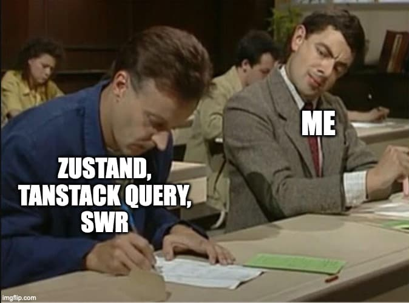

import { Callout, Tabs, Tab } from 'nextra-theme-docs';
import Link from 'next/link';

import Banner from './_components/Banner';
import Demo from './_components/Demo';
import JsOrTs from './_components/JsOrTs';

<Banner />

<h2 className="text-center font-bold text-3xl md:text-4xl lg:text-5xl pt-8 pb-6 md:pb-8 lg:pt-10">
  {'Inspiration'}
</h2>

<div className="[&>*]:flex [&>*]:justify-center pt-4">

</div>

<div className="text-center pt-6">

This library was highly-inspired by [Zustand](https://github.com/pmndrs/zustand), [TanStack Query](https://tanstack.com/query), and [SWR](https://swr.vercel.app/).<br />
Its DX will be very similar to Zustand's. [[See comparison]](/docs/comparison)

</div>

<h2 className="text-center font-bold text-3xl md:text-4xl lg:text-5xl pt-20 pb-5 md:pb-8 lg:pt-24">
  {'What Will You Get'}
</h2>

- A global state manager just like Zustand.
- A data fetching state manager just like TanStack Query & SWR, but tastes like Zustand.
- A smaller bundle size package.

```js
import { create } from 'zustand'; // 3.3 kB (gzipped: 1.5 kB)
import { createStore } from 'floppy-disk'; // 1.3 kB (gzipped: 702 B) 🎉

import { QueryClient, QueryClientProvider, useQuery, useInfiniteQuery, useMutation } from '@tanstack/react-query'; // 41 kB (gzipped: 11 kB)
import { createQuery, createMutation } from 'floppy-disk'; // 8.8 kB (gzipped: 3 kB) 🎉
```

<Callout type="info" emoji="🍽">
  <div>Have a taste?</div>
  <div>› Zustand + ReactQuery: [demo-zustand-react-query.vercel.app](https://demo-zustand-react-query.vercel.app/) <span className="inline-block">(Total: **309.21 kB**)</span></div>
  <div>› Floppy Disk: [demo-floppy-disk.vercel.app](https://demo-floppy-disk.vercel.app/) <span className="inline-block">(Total: **271.15 kB** 🎉)</span></div>
</Callout>

<div className="border border-dashed dark:opacity-20 mt-16 md:mt-20 lg:mt-24 -mx-6 md:-mx-8 xl:-mx-48" />

<h2 className="text-center font-bold text-3xl md:text-4xl lg:text-5xl pt-14 pb-5 md:pb-8 lg:pt-20">
  {'Store'}
</h2>

<Demo />

<Tabs items={['my-store.ts', 'cards.tsx']}>
  <Tab>
    ```ts
    import { createStore } from 'floppy-disk';

    type MyStore = {
      count: number;
      shape: string;
      increment: () => void;
      changeShape: () => void;
    };
    export const useMyStore = createStore<MyStore>(({ set, get }) => ({
      count: 3,
      shape: 'square',
      increment: () => set((prev) => ({ count: prev.count + 1 })),
      changeShape: () => {
        const { shape } = get();
        let nextShape;
        if (shape === 'square') nextShape = 'circle';
        else if (shape === 'circle') nextShape = 'triangle';
        else nextShape = 'square';
        set({ shape: nextShape });
      },
    }));
    ```

  </Tab>
  <Tab>
    ```tsx {1,4,14,19,24,37}
    import { useMyStore } from './my-store';

    function Card1() {
      const { count, shape } = useMyStore();
      return (
        <div>
          <div>Count: {count}</div>
          <div>Shape: {shape}</div>
        </div>
      );
    }

    function Card2() {
      const { count } = useMyStore((state) => [state.count]);
      return <div>Count: {count}</div>;
    }

    function Card3() {
      const { shape } = useMyStore((state) => [state.shape]);
      return <div>Shape: {shape}</div>;
    }

    function Card4() {
      const { count } = useMyStore((state) => [state.count % 5 === 0]);
      return (
        <div className={cn(count % 5 ? 'bg-rose-500' : 'bg-green-500')}>
          Only re-render when
          <i>&quot;count value is a multiple of 5&quot;</i> is changed
        </div>
      );
    }

    function Card5() {
      const { increment, changeShape } = useMyStore.get();
      return (
        <div>
          <div>
            <button onClick={increment}>
              Increment
            </button>
            <button onClick={changeShape}>
              Change Shape
            </button>
            <button onClick={() => alert(JSON.stringify(useMyStore.get(), null, 2))}>
              Get State
            </button>
            <button
              onClick={() => useMyStore.set((prev) => ({ count: prev.count + 1 }), true)}
            >
              Increment Silently 🤫
            </button>
          </div>
        </div>
      );
    }

    function Card6() {
      const { count, shape } = useMyStore.get();
      const [isMuted, setIsMuted] = useState(true);
      const [, reRender] = useState<any>();

      useEffect(() => {
        if (!isMuted) {
          return useMyStore.subscribe(reRender);
        }
      }, [isMuted]);

      return (
        <div>
          <div>{isMuted ? '🔕' : '🔔'}</div>
          <button onClick={() => setIsMuted((prev) => !prev)}>
            {isMuted ? 'Unmute' : 'Mute'}
          </button>
          <div className={cn(isMuted && 'opacity-50')}>
            <div>Count: {count}</div>
            <div>Shape: {shape}</div>
          </div>
        </div>
      );
    }
    ```

  </Tab>
</Tabs>

<div className="border border-dashed dark:opacity-20 mt-16 md:mt-20 lg:mt-24 -mx-6 md:-mx-8 xl:-mx-48" />

<h2 className="text-center font-bold text-3xl md:text-4xl lg:text-5xl pt-14 pb-5 md:pb-8 lg:pt-20">
  {'Query & Mutation'}
</h2>

<JsOrTs>

  <Tabs items={['single-query.jsx', 'infinite-query.jsx', 'mutation.jsx']}>
    <Tab>
      ```jsx
      import { createQuery } from 'floppy-disk';

      // Without param
      const useLatestPokemonQuery = createQuery(
        async () => {
          const res = await fetch('/api/pokemons/latest');
          const resJson = await res.json();
          if (res.ok) return resJson;
          throw resJson;
        }
      );

      // With param
      const usePokemonDetailQuery = createQuery(
        async ({ id }) => {
          const res = await fetch(`/api/pokemons/${id}`);
          const resJson = await res.json();
          if (res.ok) return resJson;
          throw resJson;
        }
      );

      function LatestPokemonPage() {
        const { isLoading, data, error } = useLatestPokemonQuery();
        if (error) return <div>Something went wrong</div>;
        if (isLoading) return <div>Loading...</div>;
        return <div>Latest pokemon is {data.name}</div>;
      }

      function PokemonDetailPage({ id }) {
        const { isLoading, data, error } = usePokemonDetailQuery({ id });
        if (error) return <div>Something went wrong</div>;
        if (isLoading) return <div>Loading...</div>;
        return <div>Pokemon: {data.name}</div>;
      }
      ```

    </Tab>
    <Tab>
      ```jsx
      import { createQuery } from 'floppy-disk';

      const usePokemonsQuery = createQuery(
        async (_, { pageParam = 0 }) => {
          const res = await fetch(`/api/pokemon?limit=10&offset=${pageParam}`);
          const resJson = await res.json();
          if (res.ok) return resJson;
          throw resJson;
        },
        {
          select: (response, { data }) => [...(data || []), ...response.results],
          getNextPageParam: (lastPageResponse, i) => {
            if (i > 5) return undefined; // Return undefined means we have reached the end of the pages
            return i * 10;
          },
        },
      );

      function PokemonListPage() {
        const { data, fetchNextPage, isWaitingNextPage, hasNextPage, error } = usePokemonsQuery();

        return (
          <ul>
            {data?.map((pokemon) => {
              return <li key={pokemon.id}>{pokemon.name}</li>;
            })}
          </ul>
        );
      }
      ```

    </Tab>
    <Tab>
      ```jsx
      import { createMutation } from 'floppy-disk';

      const useLoginMutation = createMutation(
        async (variables) => {
          const res = await axios.post('/auth/login', {
            email: variables.email,
            password: variables.password,
          });
          return res.data;
        },
        {
          onSuccess: (response, variables) => {
            console.log(`Logged in as ${variables.email}`);
            console.log(`Access token: ${response.data.accessToken}`);
          },
        },
      );

      function Login() {
        const { mutate, isWaiting } = useLoginMutation();
        const showToast = useToast();

        return (
          <button
            disabled={isWaiting}
            onClick={() => {
              mutate({ email: 'foo@bar.baz', password: 's3cREt' })
                .then(({ response, error }) => {
                  if (error) showToast('Login failed');
                  else showToast('Login success');
                });
            }}
          >
            Login
          </button>
        );
      }
      ```

    </Tab>

  </Tabs>

  <Tabs items={['single-query.tsx', 'infinite-query.tsx', 'mutation.tsx']}>
    <Tab>
      ```tsx
      import { createQuery } from 'floppy-disk';

      type Pokemon = { id: string; name: string };

      // Without param
      const useLatestPokemonQuery = createQuery<undefined, Pokemon>(
        async () => {
          const res = await fetch('/api/pokemons/latest');
          const resJson = await res.json();
          if (res.ok) return resJson;
          throw resJson;
        }
      );

      // With param
      const usePokemonDetailQuery = createQuery<{ id: number }, Pokemon>(
        async ({ id }) => {
          const res = await fetch(`/api/pokemons/${id}`);
          const resJson = await res.json();
          if (res.ok) return resJson;
          throw resJson;
        }
      );

      function LatestPokemonPage() {
        const { isLoading, data, error } = useLatestPokemonQuery();
        if (error) return <div>Something went wrong</div>;
        if (isLoading) return <div>Loading...</div>;
        return <div>Latest pokemon is {data.name}</div>;
      }

      function PokemonDetailPage({ id }: { id: number }) {
        const { isLoading, data, error } = usePokemonDetailQuery({ id });
        if (error) return <div>Something went wrong</div>;
        if (isLoading) return <div>Loading...</div>;
        return <div>Pokemon: {data.name}</div>;
      }
      ```

    </Tab>
    <Tab>
      ```tsx
      import { createQuery } from 'floppy-disk';

      type PokemonsResponse = { results: Pokemon[]; success: boolean }
      type Pokemon = { id: number; name: string };

      const usePokemonsQuery = createQuery<undefined, PokemonsResponse, Pokemon[]>(
        async (_, { pageParam = 0 }) => {
          const res = await fetch(`/api/pokemon?limit=10&offset=${pageParam}`);
          const resJson = await res.json();
          if (res.ok) return resJson;
          throw resJson;
        },
        {
          select: (response, { data }) => [...(data || []), ...response.results],
          getNextPageParam: (lastPageResponse, i) => {
            if (i > 5) return undefined; // Return undefined means we have reached the end of the pages
            return i * 10;
          },
        },
      );

      function PokemonListPage() {
        const { data, fetchNextPage, isWaitingNextPage, hasNextPage, error } = usePokemonsQuery();

        return (
          <ul>
            {data?.map((pokemon) => {
              return <li key={pokemon.id}>{pokemon.name}</li>;
            })}
          </ul>
        );
      }
      ```

    </Tab>
    <Tab>
      ```tsx
      import { createMutation } from 'floppy-disk';

      type LoginResponse = {
        success: boolean;
        data: { accessToken: string };
      };

      const useLoginMutation = createMutation<{ email: string; password: string }, LoginResponse>(
        async (variables) => {
          const res = await axios.post('/auth/login', {
            email: variables.email,
            password: variables.password,
          });
          return res.data;
        },
        {
          onSuccess: (response, variables) => {
            console.log(`Logged in as ${variables.email}`);
            console.log(`Access token: ${response.data.accessToken}`);
          },
        },
      );

      function Login() {
        const { mutate, isWaiting } = useLoginMutation();
        const showToast = useToast();

        return (
          <button
            disabled={isWaiting}
            onClick={() => {
              mutate({ email: 'foo@bar.baz', password: 's3cREt' })
                .then(({ response, error }) => {
                  if (error) showToast('Login failed');
                  else showToast('Login success');
                });
            }}
          >
            Login
          </button>
        );
      }
      ```

    </Tab>

  </Tabs>

</JsOrTs>

<div className="border border-dashed dark:opacity-20 mt-16 md:mt-20 lg:mt-24 -mx-6 md:-mx-8 xl:-mx-48" />

<h2 className="text-center font-bold text-3xl md:text-4xl lg:text-5xl pt-14 pb-5 md:pb-8 lg:pt-20">
  {'Features'}
</h2>

<section className="[&>ul>li]:mb-8 [&>ul>li>strong]:text-xl">
- **Create Store**
  - Get/set store inside/outside component
  - Custom reactivity (like `useEffect`'s dependency array)
  - Support middleware
  - Set state interception
  - Store event (`onSubscribe`, `onUnsubscribe`, etc.)
  - Use store as local state manager
- **Create Stores**
  - Same as store, but controlled with a store key
- **Create Query & Mutation**
  - Backend agnostic (support GraphQL & any async function)
  - TypeScript ready
  - SSR/SSG support
  - Custom reactivity (we choose when to re-render)
  - **Create query**
    - Dedupe multiple request
    - Auto-fetch on mount or manual (lazy query)
    - Enable/disable query
    - Serve stale data while revalidating
    - Retry on error (customizable)
    - Optimistic update
    - Invalidate query
    - Reset query
    - Query with param (query key)
    - Paginated/infinite query
    - Prefetch query
    - Suspense mode
    - Fetch from inside/outside component
    - Get query state inside/outside component
  - **Create mutation**
    - Mutate from inside/outside component
    - Get mutation state inside/outside component
</section>

<div className="flex pt-20 pb-12 justify-center gap-4">
  <Link className="btn" href="/docs/getting-started">Get Started!</Link>
  <a className="btn-secondary" href="https://github.com/afiiif/floppy-disk/tree/main/examples">See Examples</a>
</div>
