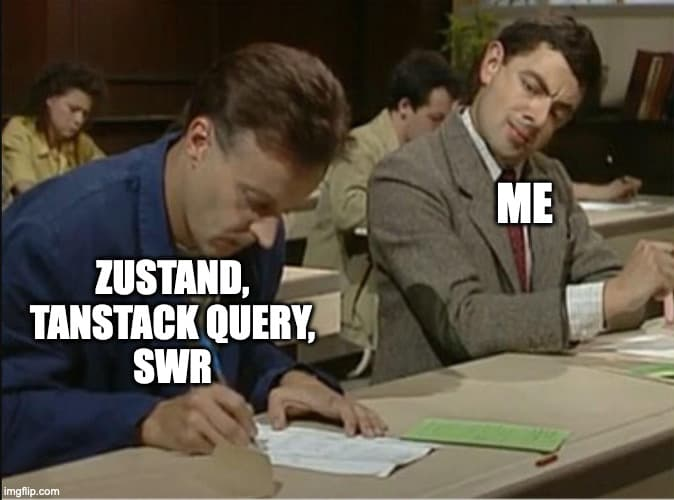

import { Callout, Tabs, Tab } from 'nextra-theme-docs'

import Banner from './homepage/Banner'
import Demo from './homepage/Demo'

<Banner />

<h2 className="text-center font-bold text-3xl md:text-4xl lg:text-5xl pt-8 pb-6 md:pb-8 lg:pt-10">
  {'Inspiration'}
</h2>

<div className="[&>*]:flex [&>*]:justify-center pt-4">

</div>

<div className="text-center pt-6">

This library was highly-inspired by [Zustand](https://github.com/pmndrs/zustand), [TanStack Query](https://tanstack.com/query), and [SWR](https://swr.vercel.app/).<br />Its DX will be very similar to Zustand's.

</div>

<h2 className="text-center font-bold text-3xl md:text-4xl lg:text-5xl pt-20 pb-5 md:pb-8 lg:pt-24">
  {'What Will You Get'}
</h2>

- A global state manager just like Zustand.
- A data fetching state manager just like TanStack Query & SWR, but tastes like Zustand.
- A smaller bundle size package.

```js
import { create } from 'zustand'; // 3.3 kB (gzipped: 1.5 kB)
import { createStore } from 'floppy-disk'; // 1.3 kB (gzipped: 702 B) 🎉

import { QueryClient, QueryClientProvider, useQuery, useInfiniteQuery, useMutation } from '@tanstack/react-query'; // 41 kB (gzipped: 11 kB)
import { createQuery, createMutation } from 'floppy-disk'; // 8.1 kB (gzipped: 2.7 kB) 🎉
```

<Callout type="info" emoji="🍽">
  <div>Have a taste?</div>
  <div>› Zustand + ReactQuery: [demo-zustand-react-query.vercel.app](https://demo-zustand-react-query.vercel.app/) <span className="inline-block">(Total: **309.21 kB**)</span></div>
  <div>› Floppy Disk: [demo-floppy-disk.vercel.app](https://demo-floppy-disk.vercel.app/) <span className="inline-block">(Total: **284.8 kB** 🎉)</span></div>
</Callout>

<div className="border border-dashed opacity-20 mt-16 md:mt-20 lg:mt-24 -mx-6 md:-mx-8 xl:-mx-48" />

<h2 className="text-center font-bold text-3xl md:text-4xl lg:text-5xl pt-14 pb-5 md:pb-8 lg:pt-20">
  {'Subscriptions & Actions'}
</h2>

<Demo />

<Tabs items={['my-store.ts', 'cards.tsx']}>
  <Tab>
    ```ts
    import { createStore } from 'floppy-disk';

    type MyStore = {
      count: number;
      shape: string;
      increment: () => void;
      changeShape: () => void;
    };
    export const useMyStore = createStore<MyStore>(({ set }) => ({
      count: 3,
      shape: 'square',
      increment: () => set((prev) => ({ count: prev.count + 1 })),
      changeShape: () => {
        set(({ shape }) => {
          if (shape === 'square') return { shape: 'circle' };
          if (shape === 'circle') return { shape: 'triangle' };
          return { shape: 'square' };
        });
      },
    }));
    ```

  </Tab>
  <Tab>
    ```tsx {1,4,14,19,24,37}
    import { useMyStore } from './my-store';

    function Card1() {
      const { count, shape } = useMyStore();
      return (
        <div>
          <div>Count: {count}</div>
          <div>Shape: {shape}</div>
        </div>
      );
    }

    function Card2() {
      const { count } = useMyStore((state) => [state.count]);
      return <div>Count: {count}</div>;
    }

    function Card3() {
      const { shape } = useMyStore((state) => [state.shape]);
      return <div>Shape: {shape}</div>;
    }

    function Card4() {
      const { count } = useMyStore((state) => [state.count % 5 === 0]);
      return (
        <div>
          <div className={cn(count % 5 ? 'bg-rose-500' : 'bg-green-500')} />
          <div>
            Only re-render when
            <i>&quot;count value is a multiple of 5&quot;</i> is changed
          </div>
        </div>
      );
    }

    function Card5() {
      const { increment, changeShape } = useMyStore.get();
      return (
        <div>
          <div>
            <button onClick={increment}>
              Increment
            </button>
            <button onClick={changeShape}>
              Change Shape
            </button>
            <button onClick={() => alert(JSON.stringify(useMyStore.get(), null, 2))}>
              Get State
            </button>
            <button
              onClick={() => useMyStore.set((prev) => ({ count: prev.count + 1 }), true)}
            >
              Increment Silently 🤫
            </button>
          </div>
        </div>
      );
    }

    function Card6() {
      const { count, shape } = useMyStore.get();
      const [isMuted, setIsMuted] = useState(true);
      const [, reRender] = useState<any>();

      useEffect(() => {
        if (!isMuted) {
          return useMyStore.subscribe(reRender);
        }
      }, [isMuted]);

      return (
        <div>
          <div>{isMuted ? '🔕' : '🔔'}</div>
          <button onClick={() => setIsMuted((prev) => !prev)}>
            {isMuted ? 'Unmute' : 'Mute'}
          </button>
          <div className={cn(isMuted && 'opacity-50')}>
            <div>Count: {count}</div>
            <div>Shape: {shape}</div>
          </div>
        </div>
      );
    }
    ```

  </Tab>
</Tabs>
